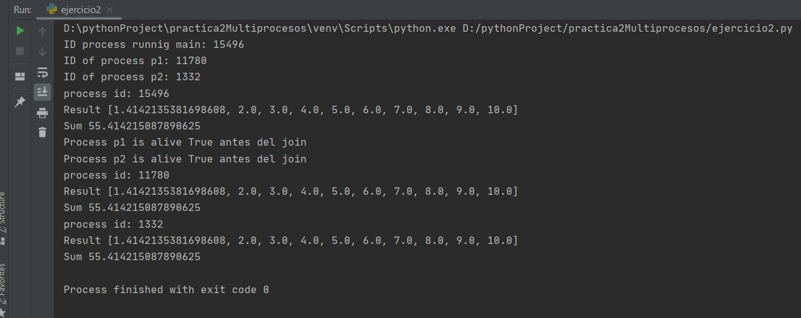

# Practica 2 Multiprocesos

Ejercicios en Python

## Ejercicio 1

Ejercicio 1:
Basándonos en los ejemplos que tenemos disponibles en Aules sobre multiprocessing, realizad el siguiente programa.
Data esta lista de elementos: mylist = [2,4,9,16,25,36,49,64,81,100]

Queremos que nuestro programa obtenga la lista de todas las raíces cuadradas de cada elemento y la suma total de los valores de la lista de raíces cuadradas.

En este caso la implementación tiene que ser sin memoria compartida y usando solo un proceso a parte del proceso de ejecución principal. Es decir, el del main y uno nuevo que crearemos. Al final de la ejecución ambos procesos tiene que mostrar el resultado de su lista de raíces cuadradas y la suma.
Comprobar si el proceso secundario está vivo y mostrarlo por pantalla.

Escribe la respuesta obtenida en consola:

## Ejercicio 2

Repetimos el mismo ejercicio que en el caso anterior pero ahora lo que queremos es trabajar con memoria compartida. Aparte del proceso principal main, ahora queremos crear dos procesos y que ellos trabajen los dos sobre la misma función que calcula las raíces cuadradas de los elementos de la lista.
Mostrar para cada proceso nuevo creado, su pid y no esperar a hacer el join para ver el orden en el que se ejecutan.
Mostrar también el resultado del valor de la lista y la suma de sus elementos para cada uno de los procesos ejecutados.

Escribe la respuesta obtenida en consola:

